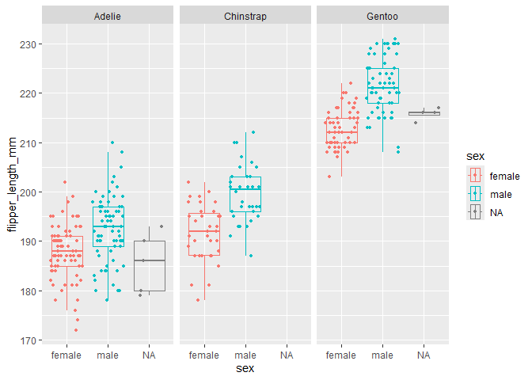

Penguins
================
Sachi Srivastava
2024-09-13

## Data

The Palmer Penguins dataset was made available by Dr. Kristen Gorman and
the Palmer Station, Antarctica LTER (Long Term Ecological Research)
Network. The package includes 2 datasets, one raw, and one modified, to
aid in data visualization. More information is available at this link:
<https://allisonhorst.github.io/palmerpenguins/>

<br>

<figure>

<figcaption aria-hidden="true">These are the three types of penguins
observed at Palmer Station.</figcaption>
</figure>

<br>

Let’s install and load the Palmer Penguins package.

``` r
library(palmerpenguins)
library(tidyverse)
```

    ## ── Attaching core tidyverse packages ──────────────────────── tidyverse 2.0.0 ──
    ## ✔ dplyr     1.1.4     ✔ readr     2.1.5
    ## ✔ forcats   1.0.0     ✔ stringr   1.5.1
    ## ✔ ggplot2   3.5.1     ✔ tibble    3.2.1
    ## ✔ lubridate 1.9.3     ✔ tidyr     1.3.1
    ## ✔ purrr     1.0.2     
    ## ── Conflicts ────────────────────────────────────────── tidyverse_conflicts() ──
    ## ✖ dplyr::filter() masks stats::filter()
    ## ✖ dplyr::lag()    masks stats::lag()
    ## ℹ Use the conflicted package (<http://conflicted.r-lib.org/>) to force all conflicts to become errors

``` r
view(penguins)
```

<br>

## Single trait distribution

Now we are ready to visualize the distribution of a single trait. Let’s
look at the density distribution of bill sizes among the three species
surveyed at Palmer Station.

``` r
ggplot(penguins) +
  geom_density(mapping = aes(bill_length_mm, fill = species), alpha = 0.5) + 
    facet_wrap(~species, nrow=3)
```

<!-- -->

Let’s also see how these traits overlap.

``` r
ggplot(penguins) +
  geom_density(mapping = aes(bill_length_mm, fill = species), alpha = 0.5)
```

<!-- --> <br>

## Sexual dimorphism

Now, let’s look at the relationship between multiple traits. Let’s find
out if any of the surveyed traits are sexually dimorphic.

Let’s look at bill length and depth

``` r
  ggplot(penguins) +
  geom_point(mapping = aes(x = bill_length_mm, y=bill_depth_mm, color=sex), size = 1) +
  facet_wrap(~species)
```

<!-- --> It appears
that Chinstrap penguins have the greatest degree of sexual dimorphism
for these traits.

<br>

Now, let’s look at body mass and flipper size.

``` r
 ggplot(penguins) +
  geom_point(mapping = aes(x = flipper_length_mm, y = body_mass_g, color=sex), size = 1) +
  facet_wrap(~species)
```

<!-- --> It looks
like the degree of sexual dimorphism for these traits is highest in
Gentoo penguins.

<br>

Let’s simplify how we are visualizing the data, using the example of
flipper length.

``` r
penguins %>%
  ggplot(mapping = aes(x=flipper_length_mm, y=sex, color=sex)) +
  geom_boxplot(outlier.alpha = 0, alpha=0) +
  geom_jitter(width = 0, size=1) +
  coord_flip() +
  facet_wrap(~species)
```

<!-- -->

## Multiple Traits

Finally, let’s look at the distribution of multiple traits in the
surveyed penguins.Let’s look at body mass and flipper size by species.

``` r
 ggplot(penguins) +
  geom_point(mapping = aes(x = body_mass_g, y = flipper_length_mm, color=species), size = 1)
```

<!-- -->

We are done exploring these data for now! What other relationships can
you find between the variables in this data set?
